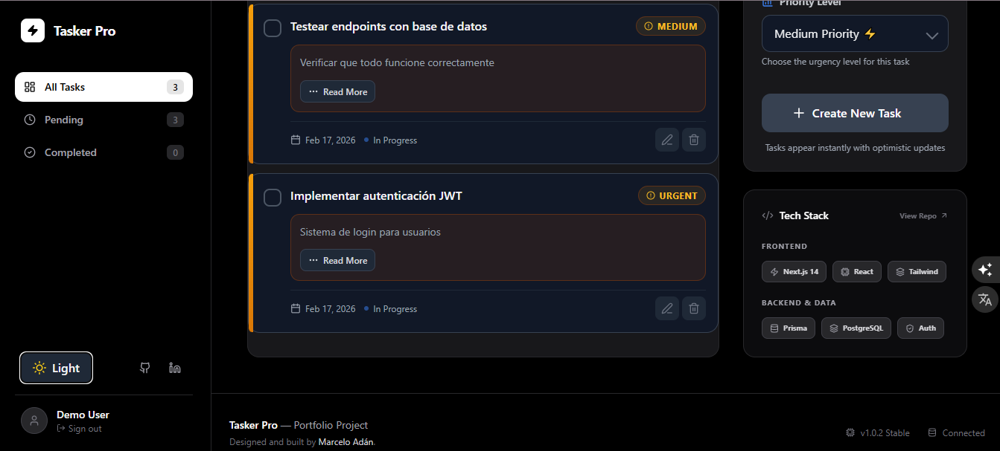
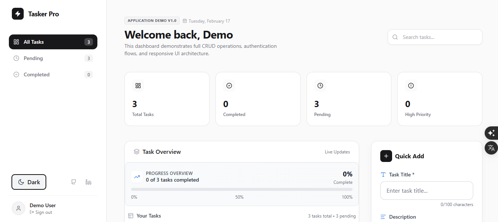
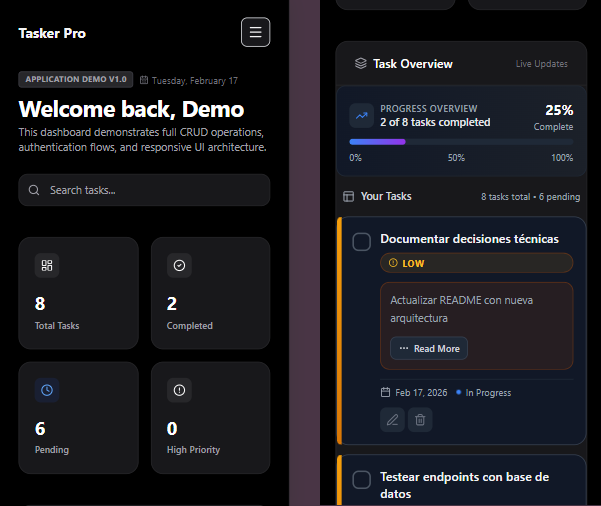

# 🚀 Task Manager Pro - Full-Stack Application

[](https://nextjs.org/)
[](https://www.typescriptlang.org/)
[](https://tanstack.com/query/latest)
[](https://nodejs.org/)
[](https://expressjs.com/)
[](https://www.postgresql.org/)
[](https://www.prisma.io/)
[](https://www.docker.com/)
[](https://jwt.io/)
[](https://vercel.com)
[](https://render.com/)
[](LICENSE)

---

## 🌐 Live Application

<div align="center">

| Environment | 🔗 URL | 📊 Status |
|:-----------:|:-------|:---------:|
| **🎨 Frontend** <br/> (Vercel) | [](https://task-manager-pro-psi.vercel.app) | 🟢 Active |
| **⚙️ Backend API** <br/> (Render) | [](https://task-manager-backend-le9g.onrender.com) | 🟢 Active |
| **🩺 Health Check** <br/> (PostgreSQL) | [](https://task-manager-backend-le9g.onrender.com/api/health) | ✅ Connected |

---

## 📖 Overview

**Task Manager Pro** is a professional full-stack task management application built with modern technologies and best practices. It features secure JWT authentication, real-time optimistic updates, and a responsive dark-themed UI. The application is fully containerized with Docker and deployed to production with CI/CD pipelines.

> 🧠 **Architected by Marcelo Adán**  
> "Code orchestrated by me with AI support as a development tool, maintaining professional standards and architectural decisions typical of a Full-Stack developer."

---

## 📸 Application Screenshots

| Dark Mode Dashboard | Light Mode Dashboard |
|---------------------|---------------------|
|  |  |

| Task Creation Modal | Mobile Responsive View |
|---------------------|----------------------|
|  |  |

### 🖼️ Screenshots Description

| Image | Description |
|-------|-------------|
| **Dark Mode** | Main dashboard with dark theme, showing task list with priority badges (MEDIUM, HIGH, URGENT) and "In Progress" status indicators |
| **Dashboard** | Light mode overview with task statistics (3 total, 0 completed) and progress bars showing 50% completion rate |
| **Task Creation** | Modal form for creating new tasks with title (8/100 chars), description (0/500 chars), and priority selector (Medium selected) |
| **Mobile View** | Responsive mobile layout with search bar, progress overview (25% complete), and task cards with "Read More" options |

### 🎯 Key UI Features Demonstrated

| Feature | Location |
|---------|----------|
| ✅ Dark/Light theme toggle | Both dashboard views |
| ✅ Priority badges (LOW/MEDIUM/HIGH/URGENT) | Dark Mode screenshot |
| ✅ Progress tracking | Dashboard (50% bar) |
| ✅ Form validation | Task Creation (character counters) |
| ✅ Responsive design | Mobile View |
| ✅ Task metadata (date, status) | All views |
| ✅ Optimistic updates | Task Creation footer |

---

## ✨ Key Features

### 🔐 **Authentication & Security**
- **✅ JWT Authentication** - Secure login with token-based authentication
- **🛡️ Password Hashing** - Bcrypt for secure password storage
- **🔒 Protected Routes** - Middleware for endpoint authorization
- **🚦 Rate Limiting** - Protection against brute-force attacks
- **🛡️ Helmet.js** - Secure HTTP headers configuration

### 📋 **Task Management**
- **➕ Create Tasks** - Add new tasks with title, description, and priority
- **✏️ Edit Tasks** - Modify existing task details
- **✅ Toggle Completion** - Mark tasks as complete/incomplete
- **🗑️ Delete Tasks** - Remove tasks from the system
- **🎯 Priority Levels** - LOW, MEDIUM, HIGH, URGENT

### 🎨 **Modern UI/UX**
- **🌙 Dark Mode** - Toggle between light and dark themes
- **📱 Responsive Design** - Mobile-first approach for all devices
- **⚡ Optimistic Updates** - Instant UI feedback with React Query
- **🎯 Priority Badges** - Color-coded priority indicators
- **🔄 Loading States** - Skeleton loaders and progress indicators

### 🚀 **Technical Excellence**
- **⚡ Next.js 16 App Router** - Modern React framework with server components
- **🎭 TypeScript Strict Mode** - 0 errors, end-to-end type safety
- **📊 React Query v5** - Advanced caching and optimistic updates
- **🗄️ PostgreSQL + Prisma** - Type-safe database ORM with migrations
- **🐳 Docker Multi-stage** - Optimized container builds
- **🔧 CI/CD Pipeline** - Automated deployments via GitHub

---

## 🛠️ Technology Stack

### **Frontend**
| Category | Technology | Version | Purpose |
|----------|------------|---------|---------|
| **Framework** |  | 16.1.3 | React framework with App Router |
| **Language** |  | 5.9.3 | Type safety, 0 errors |
| **State Management** |  | 5.90.19 | Server state, caching |
| **Styling** |  | 3.4 | Utility-first CSS |
| **UI Components** |  | 12.29 | Animations |
| **Icons** |  | 0.563 | Icon library |
| **Testing** |  +  | - | Unit & integration tests (56 tests) |
| **Date Handling** |  | 4.1 | Date formatting |

### **Backend**
| Category | Technology | Version | Purpose |
|----------|------------|---------|---------|
| **Runtime** |  | 20.x | JavaScript runtime |
| **Framework** |  | 4.22 | Web framework |
| **Language** |  | 5.9.3 | Type safety |
| **Database** |  | 15 | Relational database |
| **ORM** |  | 6.19.2 | Type-safe database client |
| **Authentication** |  +  | - | Secure auth |
| **Validation** |  | 4.3 | Schema validation |
| **Security** |  +  | - | Security headers |
| **Testing** |  +  | - | Integration tests (30 tests) |

### **DevOps & Deployment**
| Category | Technology | Purpose |
|----------|------------|---------|
| **Containerization** |  | Multi-stage builds |
| **Orchestration** |  | Local development stack |
| **Frontend Hosting** |  | Production deployment |
| **Backend Hosting** |  | API + PostgreSQL |
| **Version Control** |  +  | Source code |
| **CI/CD** |  | Automated pipelines |

---
## 📁 Project Architecture

<details>
<summary><b>📂 Click to expand full project structure</b></summary>

```
task-manager-pro/
│
├── 📁 frontend/                               # Next.js 16 + TypeScript
│   ├── 📁 src/
│   │   ├── 📁 app/                            # App Router
│   │   │   ├── 📄 layout.tsx                  # Root layout
│   │   │   ├── 📄 page.tsx                    # Dashboard
│   │   │   └── 📁 login/                       # Login page
│   │   │
│   │   ├── 📁 components/                      # UI Components
│   │   │   ├── 📁 TaskCard/                    # Task card
│   │   │   ├── 📁 TaskForm/                    # Create task
│   │   │   ├── 📁 TaskList/                    # Task list
│   │   │   ├── 📁 TaskEditModal/               # Edit modal
│   │   │   └── 📁 DarkModeToggle/              # Theme switcher
│   │   │
│   │   ├── 📁 context/                         # React Context
│   │   │   ├── 📄 AuthContext.tsx              # Auth state
│   │   │   └── 📄 ThemeContext.tsx             # Dark/light theme
│   │   │
│   │   ├── 📁 hooks/                           # Custom Hooks
│   │   │   ├── 📄 useTasks.ts                  # React Query
│   │   │   └── 📄 useTasks.test.tsx
│   │   │
│   │   ├── 📁 lib/                             # Utilities
│   │   │   ├── 📁 api/                         # API client
│   │   │   └── 📁 types/                       # TypeScript types
│   │   │
│   │   └── 📁 __tests__/                        # Frontend tests (56)
│   │
│   └── 📁 config/                               # Configuration files
│       ├── 📄 Dockerfile
│       ├── 📄 vercel.json
│       ├── 📄 next.config.js
│       ├── 📄 tailwind.config.js
│       ├── 📄 jest.config.js
│       └── 📄 package.json
│
├── 📁 backend/                                 # Express + TypeScript + Prisma
│   ├── 📁 src/
│   │   ├── 📁 controllers/                     # Business logic
│   │   │   ├── 📄 auth.controller.ts           # Login/register
│   │   │   └── 📄 task.controller.ts           # Task CRUD
│   │   │
│   │   ├── 📁 middleware/                       # Express middleware
│   │   │   ├── 📄 auth.middleware.ts           # JWT
│   │   │   ├── 📄 validate.ts                  # Zod
│   │   │   ├── 📄 rateLimit.ts                 # Rate limiting
│   │   │   └── 📄 helmet.ts                    # Security
│   │   │
│   │   ├── 📁 routes/                           # API endpoints
│   │   │   ├── 📄 auth.routes.ts
│   │   │   └── 📄 task.routes.ts
│   │   │
│   │   ├── 📁 validators/                       # Zod schemas
│   │   │   ├── 📄 auth.validator.ts
│   │   │   └── 📄 task.validator.ts
│   │   │
│   │   ├── 📁 database/                         # Prisma client
│   │   │   └── 📄 prisma.ts
│   │   │
│   │   ├── 📁 config/                           # Configuration
│   │   │   ├── 📄 env.ts                       # Validation
│   │   │   └── 📄 cors.ts                      # CORS
│   │   │
│   │   └── 📄 server.ts                         # Entry point
│   │
│   ├── 📁 prisma/                               # Database
│   │   ├── 📄 schema.prisma                    # Models
│   │   ├── 📁 migrations/                       # SQL migrations
│   │   └── 📄 seed.js                           # Demo data
│   │
│   ├── 📁 tests/                                # Backend tests (30)
│   │   ├── 📁 unit/
│   │   └── 📁 setup/
│   │
│   └── 📁 config/                               # Configuration files
│       ├── 📄 Dockerfile
│       ├── 📄 render.yaml
│       ├── 📄 jest.config.js
│       ├── 📄 tsconfig.json
│       └── 📄 package.json
│
├── 📄 docker-compose.yml                        # Local development stack
│
├── 📄 .gitignore                                # Git ignored files
│
└── 📄 README.md                                 # This documentation
```
</details>

---

## 📊 Quality Metrics

| Metric | Value | Status |
|--------|-------|--------|
| **Frontend Tests** | 56/56 |  |
| **Backend Tests** | 30/30 |  |
| **Total Tests** | 86/86 |  |
| **TypeScript Errors** | 0 |  |
| **Docker Images** | 2 (backend + frontend) |  |
| **Containers** | 3 (db + backend + frontend) |  |
| **Code Comments** | 100% English |  |
| **Lighthouse Score** | >90 |  |

---

## 🚀 Quick Start Guide

### **Option 1: Try Live Demo (No Installation)**
Simply visit:
```
https://task-manager-pro-psi.vercel.app
```
Use demo credentials:
```
Email: demo@taskmanager.com
Password: demo123
```

---

### **Option 2: Local Development**

#### 📋 **Prerequisites**
- Node.js 20.x or higher
- npm 9.x or higher
- PostgreSQL 15 (optional, if not using Docker)

#### 🛠️ **Setup Instructions**

```bash
# 1. Clone the repository
git clone https://github.com/MarceloAdan73/task-manager-pro.git
cd task-manager-pro

# 2. Backend setup
cd backend
cp .env.example .env
npm install
npx prisma migrate dev
npm run dev
# Backend runs on http://localhost:3005

# 3. Frontend setup (new terminal)
cd frontend
cp .env.local.example .env.local
npm install
npm run dev
# Frontend runs on http://localhost:3004

# 4. Open browser
# http://localhost:3004
```

---

### **Option 3: Docker Setup (Recommended)**

```bash
# 1. Clone repository
git clone https://github.com/MarceloAdan73/task-manager-pro.git
cd task-manager-pro

# 2. Start all services
docker-compose up -d

# 3. Access application
# Frontend: http://localhost:3004
# Backend API: http://localhost:3005/api/health

# 4. View logs (optional)
docker-compose logs -f

# 5. Stop services
docker-compose down
```

---

### **Option 4: Production URLs**

```
🌐 Frontend: https://task-manager-pro-psi.vercel.app
⚙️ Backend:  https://task-manager-backend-le9g.onrender.com
🔍 Health:   https://task-manager-backend-le9g.onrender.com/api/health
🔑 Login:    https://task-manager-backend-le9g.onrender.com/api/auth/login
📋 Tasks:    https://task-manager-backend-le9g.onrender.com/api/tasks
```

---

## 🎮 Usage Guide

### **Authentication**
1. Navigate to the login page
2. Use demo credentials or register
3. JWT token auto-stored in localStorage

### **Task Management**

| Action | How to |
|--------|--------|
| **Create Task** | Click "Add Task" → Fill form → Submit |
| **Edit Task** | Click on task card → Modify → Save |
| **Complete Task** | Click checkbox on task card |
| **Delete Task** | Click trash icon on task card |
| **Filter Tasks** | Use tabs (All/Pending/Completed) |
| **Change Priority** | Edit task → Select priority |

### **UI Features**
- 🌙 **Dark Mode** - Click sun/moon icon in header
- 📱 **Responsive** - Works on mobile, tablet, desktop
- ⚡ **Real-time** - Optimistic updates with React Query

---

## 🔧 API Documentation

### **Base URL**
```
Production: https://task-manager-backend-le9g.onrender.com/api
Local:      http://localhost:3005/api
```

### **Authentication Endpoints**

| Method | Endpoint | Description | Request Body | Response |
|--------|----------|-------------|--------------|----------|
| **POST** | `/auth/login` | User login | `{ "email": "string", "password": "string" }` | `{ "token": "jwt", "user": {...} }` |
| **GET** | `/auth/verify` | Verify token | - | `{ "user": {...} }` |

### **Task Endpoints** (Requires JWT)

| Method | Endpoint | Description | Request Body | Response |
|--------|----------|-------------|--------------|----------|
| **GET** | `/tasks` | Get all tasks | - | `{ "data": [...] }` |
| **GET** | `/tasks/:id` | Get single task | - | `{ "data": {...} }` |
| **POST** | `/tasks` | Create task | `{ "title": "string", "description?": "string", "priority?": "LOW\|MEDIUM\|HIGH\|URGENT" }` | `{ "data": {...} }` |
| **PUT** | `/tasks/:id` | Update task | `{ "title?": "string", "description?": "string", "completed?": "boolean", "priority?": "..." }` | `{ "data": {...} }` |
| **DELETE** | `/tasks/:id` | Delete task | - | `{ "success": true }` |
| **PATCH** | `/tasks/:id/toggle` | Toggle completion | - | `{ "data": {...} }` |

### **Response Format**
```json
{
  "success": true,
  "data": {},     // For single resources
  "data": [],     // For collections
  "error": "message"
}
```

---

## 🐳 Docker Commands

| Command | Description |
|---------|-------------|
| `docker-compose up -d` | Start all services |
| `docker-compose logs -f` | View real-time logs |
| `docker-compose down` | Stop all services |
| `docker-compose down -v` | Stop and delete database |
| `docker-compose build backend` | Rebuild backend only |
| `docker exec -it taskmanager-backend sh` | Access container shell |
| `docker ps` | List running containers |
| `docker stats` | View resource usage |

---

## 🧪 Testing

### **Backend Tests**
```bash
cd backend
npm test          # Run all tests
npm test:watch    # Watch mode
npm test:coverage # Coverage report
```

### **Frontend Tests**
```bash
cd frontend
npm test          # Run all tests
npm test:watch    # Watch mode
npm test:coverage # Coverage report
```

### **Test Coverage**
```
✅ Backend: 30/30 tests
   • Auth Controller
   • Task Controller
   • Middleware
   • Utilities

✅ Frontend: 56/56 tests
   • Components
   • Hooks
   • API Client
   • Contexts
```

---

## 🚧 Future Improvements

| Short Term | Medium Term | Long Term |
|------------|-------------|-----------|
| 📊 Dashboard with charts | 👥 Team collaboration | 📱 Mobile app |
| 📄 CSV/PDF export | 🔄 WebSockets real-time | 🤖 AI task suggestions |
| 🏷️ Categories/Tags | 📎 File attachments | 📅 Calendar integration |
| ⏰ Due dates/Reminders | 📧 Email notifications | 🔐 Enterprise SSO |

---

## 🤝 Contributing

1. **Fork** the repository
2. **Create** feature branch (`git checkout -b feature/AmazingFeature`)
3. **Commit** changes (`git commit -m 'Add AmazingFeature'`)
4. **Push** to branch (`git push origin feature/AmazingFeature`)
5. **Open** a Pull Request

### **Development Guidelines**
- ✅ Write tests for new features
- ✅ Maintain 100% TypeScript strictness
- ✅ Follow existing code style
- ✅ Update documentation

---

## 📄 License

This project is licensed under the **MIT License** - see the [LICENSE](LICENSE) file for details.

---

## 👨‍💻 Author

**Marcelo Adán** - Full-Stack Developer

[](https://github.com/MarceloAdan73)
[](https://linkedin.com/in/marcelo-adan)
[](https://marcelo.dev)

> 🧠 **Architectural Note**: This project's codebase is orchestrated by Marcelo Adán, with AI assistance as a development tool to accelerate implementation while maintaining professional standards and senior-level architectural decisions.

---

## 🙏 Acknowledgements

- [Next.js Documentation](https://nextjs.org/docs)
- [Prisma Documentation](https://www.prisma.io/docs)
- [React Query Documentation](https://tanstack.com/query/latest)
- [Render Documentation](https://render.com/docs)
- [Vercel Documentation](https://vercel.com/docs)

---

## ⭐ Support

If you find this project useful, please consider giving it a star on GitHub!

[](https://github.com/MarceloAdan73/task-manager-pro)

---

<div align="center">
  <sub>Built with ❤️ by Marcelo Adán | © 2026 Task Manager Pro</sub>
</div>
